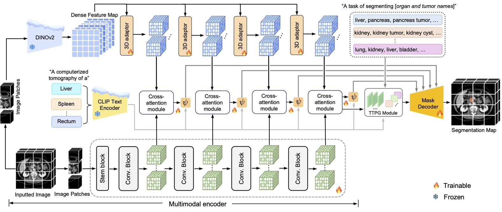

# CDPDNet

This repository is the official implementation for the paper:  
**[CDPDNet: Integrating Text Guidance with Hybrid Vision Encoders for Medical Image Segmentation](https://arxiv.org/pdf/2411.15426)**  
*Authors: Jiong Wu, Yang Xing, Boxiao Yu, Wei Shao, and Kuang Gong

>Abstract: Most publicly available medical segmentation datasets are only partially labeled, with annotations provided for a subset of anatomical structures. When multiple datasets are combined for training, this incomplete annotation poses challenges, as it limits the model's ability to learn shared anatomical representations among datasets. Furthermore, vision-only frameworks often fail to capture complex anatomical relationships and task-specific distinctions, leading to reduced segmentation accuracy and poor generalizability to unseen datasets. In this study, we proposed a novel CLIP-DINO Prompt-Driven Segmentation Network (CDPDNet), which combined a self-supervised vision transformer with CLIP-based text embedding and introduced task-specific text prompts to tackle these challenges. Specifically, the framework was constructed upon a convolutional neural network (CNN) and incorporated DINOv2 to extract both fine-grained and global visual features, which were then fused using a multi-head cross-attention module to overcome the limited long-range modeling capability of CNNs. In addition, CLIP-derived text embeddings were projected into the visual space to help model complex relationships among organs and tumors. To further address the partial label challenge and enhance inter-task discriminative capability, a Text-based Task Prompt Generation (TTPG) module that generated task-specific prompts was designed to guide the segmentation. Extensive experiments on multiple medical imaging datasets demonstrated that CDPDNet consistently outperformed existing state-of-the-art segmentation methods. 


---

## Overview

<p align="center">
  
  <br>
</p>

---

## Environment
- git clone https://github.com/wujiong-hub/CDPDNet.git
- conda create -n cdpdnet python=3.9
- conda activate cdpdnet
- pip install torch==2.4.0 torchvision==0.19.0 torchaudio==2.4.0 --index-url https://download.pytorch.org/whl/cu121
  (Please modify according to your server CUDA version)
- pip install 'monai[all]'
- pip install -r requirements.txt


## Datasets
- [01 Multi-Atlas Labeling Beyond the Cranial Vault - Workshop and Challenge (BTCV)](https://www.synapse.org/#!Synapse:syn3193805/wiki/217789)
- [02 Pancreas-CT TCIA](https://wiki.cancerimagingarchive.net/display/Public/Pancreas-CT) and The label we used for Dataset 01 and 02 is [here](https://zenodo.org/records/1169361)
- [03 Combined Healthy Abdominal Organ Segmentation (CHAOS)](https://chaos.grand-challenge.org/Combined_Healthy_Abdominal_Organ_Segmentation/)
- [04 Liver Tumor Segmentation Challenge (LiTS)](https://competitions.codalab.org/competitions/17094#learn_the_details)
- [05 Kidney and Kidney Tumor Segmentation (KiTS)](https://kits21.kits-challenge.org/participate#download-block)
- [07 WORD: A large scale dataset, benchmark and clinical applicable study for abdominal organ segmentation from CT image](https://github.com/HiLab-git/WORD)
- [08 AbdomenCT-1K](https://github.com/JunMa11/AbdomenCT-1K)
- [09 Multi-Modality Abdominal Multi-Organ Segmentation Challenge (AMOS)](https://amos22.grand-challenge.org/)
- [10 Decathlon (Liver, Lung, Pancreas, HepaticVessel, Spleen, Colon](https://drive.google.com/drive/folders/1HqEgzS8BV2c7xYNrZdEAnrHk7osJJ--2)
- [11 CT volumes with multiple organ segmentations (CT-ORG)](https://wiki.cancerimagingarchive.net/pages/viewpage.action?pageId=61080890)
- [12 AbdomenCT 12organ](https://zenodo.org/records/7860267)

The post_label can be downloaded via [link](https://portland-my.sharepoint.com/:u:/g/personal/jliu288-c_my_cityu_edu_hk/EX04Ilv4zh1Lm_HB0wnpaykB4Slef043RVWhX3lN05gylw?e=qG0DOS)

## Datasets preprocessing
1. **Download and organize the dataset**  
   Arrange the downloaded data according to the structure specified in [`dataset/dataset_list/datasets.txt`](./dataset/dataset_list/datasets.txt).

2. **Configure preprocessing parameters**  
   Open [`label_transfer.py`](./label_transfer.py) and modify the following lines:
   ```python
   ORGAN_DATASET_DIR = '/your/path/to/dataset'
   NUM_WORKER = 4  # Adjust based on your CPU
   ## For the above 11 datasets, you can directly download the post_label and arrange them in the corresponding folders.
   ```python
   python -W ignore label_transfer.py
   ```
3. ***Dataset organs/tumors and corresponding label index*
    Index  Organ                     Index  Organ                     Index  Organ                     Index  Organ
     1    Spleen                      9    Postcava                  17    Left Lung                 25    Celiac Trunk
     2    Right Kidney               10    Portal Vein & SV         18    Colon                     26    Kidney Tumor
     3    Left Kidney                11    Pancreas                 19    Intestine                 27    Liver Tumor
     4    Gall Bladder               12    Right Adrenal Gland      20    Rectum                    28    Pancreas Tumor
     5    Esophagus                  13    Left Adrenal Gland       21    Bladder                   29    Hepatic Vessel Tumor
     6    Liver                      14    Duodenum                 22    Prostate                  30    Lung Tumor
     7    Stomach                    15    Hepatic Vessel           23    Left Head of Femur        31    Colon Tumor
     8    Aorta                      16    Right Lung               24    Right Head of Femur       32    Kidney Cyst


## Training
   ```python
   CUDA_VISIBLE_DEVICES=0,1,2,3,4,5,6,7 python -m torch.distributed.launch --nproc_per_node=8 --master_port=1238 train.py --data_root_path DATA_DIR --dist True --uniform_sample
   ```
## Testing
```python
   CUDA_VISIBLE_DEVICES=0 python test.py --data_root_path DATA_DIR --resume CHECKPOINT_PATH 
```

## Acknowledgement

Some of the codes in this repo are borrowed from:
- [Latent Diffusion Model(LDM)](https://github.com/CompVis/latent-diffusion)
- [Swin-Transformer](https://github.com/microsoft/Swin-Transformer)
- [Transmatch](https://github.com/tzayuan/TransMatch_TMI)

## Citation
If you find this repository useful, please consider citing this paper:
```
@article{wu2024ldm,
  title={LDM-Morph: Latent diffusion model guided deformable image registration},
  author={Wu, Jiong and Gong, Kuang},
  journal={arXiv preprint arXiv:2411.15426},
  year={2024}
}
```


